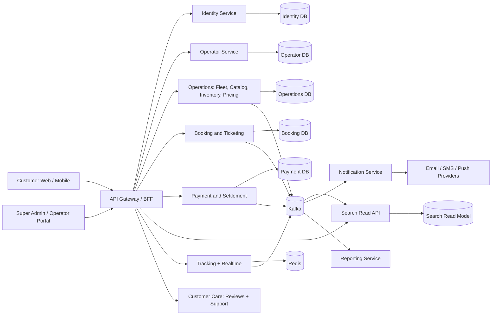
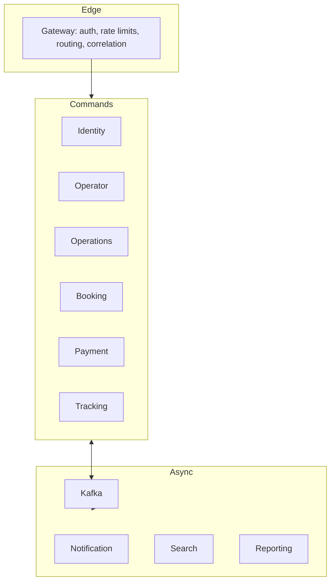
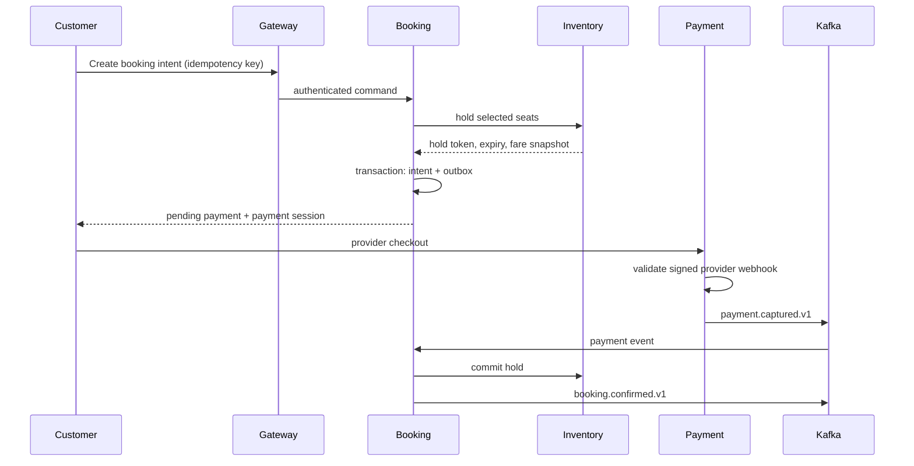
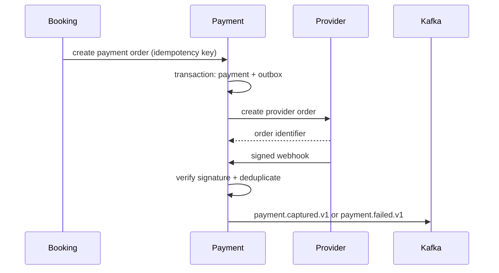
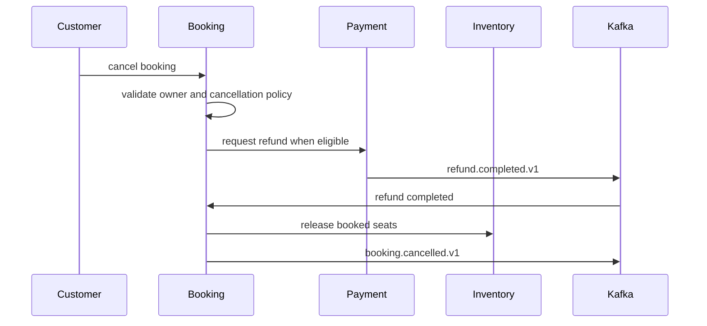

# Target-State Architecture

## Design principles

- Start with bounded modules and extract a service only for independent scaling, security, release cadence, or data ownership.
- The API gateway is the only public backend entry point. Browser and mobile clients never call internal service ports.
- PostgreSQL is partitioned by service-owned schema/database credentials; no service directly writes another service's tables.
- Commands use authenticated synchronous HTTP only where the caller needs the result. Integration events use Kafka with versioned envelopes and transactional outboxes.
- Every tenant-scoped command verifies both role and object membership.

## Proposed runtime boundaries

| Domain | Initial deployment boundary | Extract when |
| --- | --- | --- |
| Identity/Auth | `identity-service` | Keep separate now: credentials, sessions, MFA, and authorization are security-critical. |
| Operator | `operator-service` | Keep separate; owns organizations, staff memberships, compliance status. |
| Fleet + Catalog/Scheduling + Inventory | `operations-service` modular monolith | Split Fleet/Catalog from Inventory when seat-hold throughput or operational team ownership warrants it. Inventory must retain exclusive hold/commit authority. |
| Search | `search-service` | Keep separate read model; it consumes published trip, fare, availability, and review events. |
| Pricing/Promotions | Module in `operations-service` | Extract when rule evaluation, partner campaigns, or dynamic pricing become independently scaled. |
| Booking + Ticketing | `booking-service` modular boundary | Extract Ticketing only when QR validation/partner distribution requires separate scaling. |
| Payment + Settlement | `payment-service` modular boundary | Keep together initially because refunds, fees, ledger, and reconciliation are tightly coupled. |
| Notification | `notification-service` | Extract now once external SMS/email/push delivery is enabled. |
| Tracking | `tracking-service` | Keep separate for high-frequency telemetry and websocket/SSE fan-out. |
| Review + Support | Module in `customer-care-service` | Extract only for independently operated support tooling or high moderation volume. |
| Analytics + Audit/Compliance | `reporting-service` with immutable audit module | Separate read/reporting workloads; audit write capture remains in each command service's outbox. |

## System diagram

## Container diagram

## Booking sequence

## Payment sequence

## Cancellation sequence

